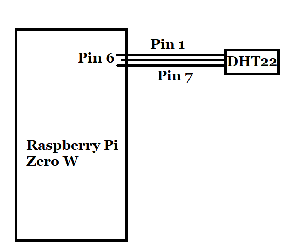
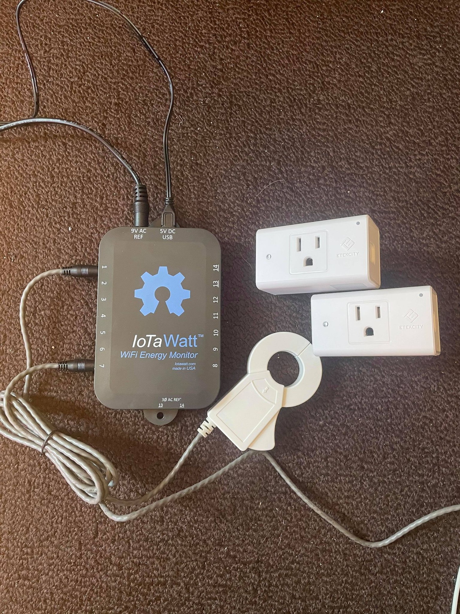
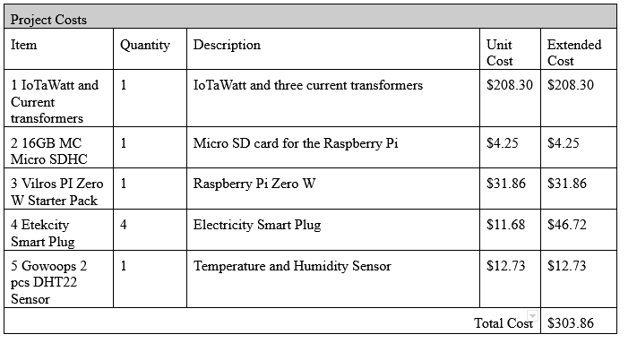
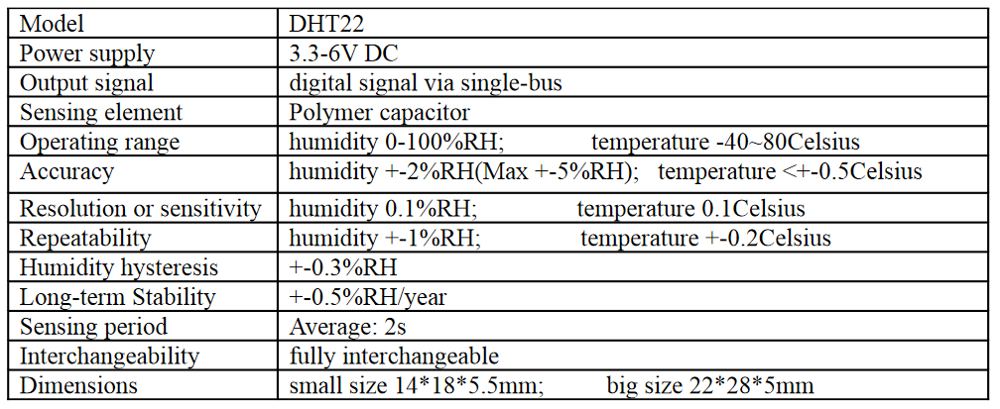
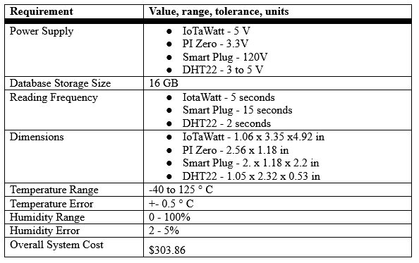

# Table of Contents

- [Schematics and Pictures](#schematics-and-pictures)
- [Bill of Materials](#bill-of-materials)
- [Datasheets and Specifications](#datasheets-and-specifications)
- [Setting up the Temperature and Humidity Sensor:](#setting-up-the-temperature-and-humidity-sensor)
- [Setting up the Etekcity ESW15 Energy plugs:](#setting-up-the-etekcity-esw15-energy-plugs)
- [Setting up the IoTaWatt](#setting-up-the-iotawatt)

## Schematics and Pictures

A rough schematic of the temperature and humidity sensor:

A picture of what the temperature and humidity sensor looks like:

A picture of the IoTaWatt with the line splitters and the ESW15 energy plugs

## Bill of Materials

## Datasheets and Specifications

DHT22 temperature and humidity sensor datasheet:

Overall project specifications:

## Setting up the Temperature and Humidity Sensor
This process is really simple:

You simply need a Raspberry Pi with pinouts, the DHT22 temperature and humidity sensor and female to female jumper wires.

Using the wires, connect the DHT22's (+) pin to the Pi's Pin 1, the DHT22's (out) pin to the Pi's Pin 7, and the DHT22's (-) pin to the Pi's Pin 6. 

That's it! The software will do the rest of the work.

## Setting up the Etekcity ESW15 Energy plugs

You need the plugs and a 2.4 GHz wifi connection. Then can be made using a WiFi hotspot using your phone or laptop.
Again setting this up is very simple:

1 - Download the Vesync app, and create an account to use. 

2 - Place the energy plug into power and press on the power button for 10 seconds or till it blinks rapidly. 

3 - While connected to the 2.4 GHz connection, use the app to go through the steps of adding a new device. 

At the end, you should be able to see that it's on and you should be able to use the app to turn the plug's night light on and off. If that works, then you are set. The software will take care of everything else but you need to enter the information of the account you created into the data collection script (**check out README_Software.md for more information about this**).

## Setting up the IoTaWatt

Vendor Information: You can buy it from IoTaWatt itself [here](https://iotawatt.com/).

The process is very intuitive, but will require a few steps before running efficently. For some background, the IoTaWatt has 15 input channels. One is reserved for measuring voltage, USB power supply, and AC voltage reference transformer.The rest of the input channels are for current transformers. You will need to have a 2.4 GHz wireless network. 

We highly suggest you do not cover the physical installation of the CTs to your electrical circuits. It should only be done by an electrician or someone comfortable enough with electrical wiring.

1 - Connect the USB power supply to the 5V DC USB port.

2 - Connect the AC transformer to the 9V AC Ref port.

3 - Plug both the power supply and AC transformer into your wall socket.

4 - Because there is a built in ESP8266 in IoTaWatt, when it initially powers up, it will attempt to connect to the last WiFi network. If you are reading this, chances are you will need to connect to a new WiFi network. The ESP8266 will enter AP mode and create its own WiFi with the SSD prefix "iota" followed by a bunch of numbers. (ex. iota324180)

5 - Connect to the ESP8266's WiFi to start get into the default page of the IoTaWatt. You will then have the option to "Configure WiFi". You will have the option to choose a network that was scanned, or if your network is hidden, you will be able to enter the necessary info in. After, the light on the IoTaWatt should turn green.

6 - With any device connected to the SAME network as the IoTaWatt, go to http://iotawatt.local. You will then see four options; Setup, Tools, Status, and Graphs. When clicking setup, you will be allowed to change the device name, but note that your IoTaWatt configuration website becomes http://devicename.local. 

7 - The AC line frequency is vital to ensuring accurate measurements. Remember that one of the ports has a 9V AC Ref, so in the inputs tab under setup, you will see that port 0 has an input active. Make sure that the model of your voltage transformer is current (there are a lot of options). 

8 - Here is where the magic of the IoTaWatt comes in. To set up a current transformer, go to inputs again and you can add by clicking the channel number button. You can edit this current transformer to a great degree. You can edit the name to be something more readable (ex. Stove, Washer/Dryer). Make sure to choose the right model for your CT.

9 - There is an option to allow negative power values, doubling to monitor 240V circuits, or reversing circuits (when the CT is installed backwards).

10 - The other end of the IoTaWatt is the outputs. You can create up to any number of outputs as long as they are uniquely named. When adding an output, you will be asked to enter a name, unit measured, and a calculator will appear below. The calculator will be like your typical calculator but there is a button for inputs, which you can select to be a variable in your output equation.
(ex. total_power = dryer_power + heat_pump_power).

11 - You can see all of the inputs and outputs in the Status tab, then under Inputs/Outputs Status. Finally, we chose influxDB because of its fast computing power for time-series data. To configure, hover over Setup tab and click Web Server from the dropdown.

12 - Choose InfluxDB. You will see a lot of options appear but we will take you through it. Post interval is how long each data point represents (5 seconds to 3600 seconds). Bulk send is how often the IoTaWatt will send the data; for our project, we chose to do every 15 seconds so balance the update frequency. The server URL of the influxDB server will always have to start with http://. Since we have our project on a local instance, our server URL was http://raspberrypiIP:8086.

13 - This step is optional. InfluxDB does not use fields such as regular SQL databases but tag-key/tag-value pairs. You can change the measurement name but the default will be the output name. Tags help increase the performance of data retrieval easier. 

