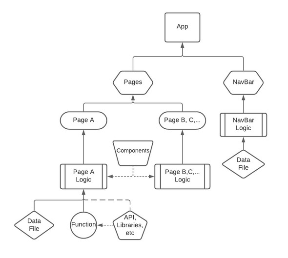

Software Report
Team Greener Living

# Table of Contents
- [Project Contents](#project-contents)
- [Pages folder](#pages-folder)
  * [home folder](#home-folder)
    + [Home.js](#homejs)
    + [HomeQuery.js](#homequeryjs)
    + [Home.css & HomeStyle.js](#homecss---homestylejs)
  * [appliances folder](#appliances-folder)
    + [Appliances.js](#appliancesjs)
    + [ApplianceSelectData.js](#applianceselectdatajs)
    + [Appliances.css](#appliancescss)
  * [rooms folder](#rooms-folder)
    + [Rooms.js](#roomsjs)
    + [RoomsSelectData.js](#roomsselectdatajs)
    + [RoomInfluxQuery.js](#roominfluxqueryjs)
    + [Rooms.css](#roomscss)
  * [buttongroupcomponent folder](#buttongroupcomponent-folder)
    + [ButtonGroup.js](#buttongroupjs)
    + [ButtonGroupData.js](#buttongroupdatajs)
    + [ButtonGroup.css](#buttongroupcss)
  * [dropdowncomponent folder](#dropdowncomponent-folder)
    + [CustomSelect.js](#customselectjs)
    + [CustomSelect.css](#customselectcss)
  * [costs folder](#costs-folder)
    + [Costs.js](#costsjs)
    + [CostsInfluxQuery.js](#costsinfluxqueryjs)
    + [Costs.css](#costscss)
  * [notifications folder](#notifications-folder)
    + [Notifications.js](#notificationsjs)
    + [NotificationsInfluxQuery.js](#notificationsinfluxqueryjs)
    + [Notifications.css](#notificationscss)
  * [weather folder](#weather-folder)
    + [Weather.js](#weatherjs)
    + [Weather.css](#weathercss)
- [navbarcomponents folder](#navbarcomponents-folder)
  * [Navbar.js](#navbarjs)
  * [NavbarData.js](#navbardatajs)
  * [Navbar.css](#navbarcss)
- [assets folder](#assets-folder)
  * [canvasjs.min.js & canvasjs.react.js](#canvasjsminjs---canvasjsreactjs)
  * [images](#images)
- [Grafana](#grafana)
- [InfluxDB](#influxdb)
- [Pyvesync_v2](#pyvesync-v2)
- [Adafruit_Python_DHT](#adafruit-python-dht)
- [Software Flow chart](#software-flow-chart)
- [Dev/buildtool information:](#dev-buildtool-information-)
- [Installation Process For the Raspberry Pi](#installation-process-for-the-raspberry-pi)
- [Installation Process For the Temperature and Humidity Sensor, and Energy Plugs:](#installation-process-for-the-temperature-and-humidity-sensor--and-energy-plugs-)
- [Running the Website](#running-the-website)

# Project Contents

# Pages folder
Here you will find the majority of code for our website.

## home folder
Code for the "Home" tab of our website.
### Home.js
The meters are displayed using embedded grafana links. The meter values are adjusted depending on stored data values. For example, if 90-100 is red, it means values between 90-100 are at the high end of stored values. CanvasJS is used to graph the yearly retail electricity rate for MA and yearly carbon dioxide emissions for MA. Data for this is obtained using api calls to the EIA or the U.S. Energy Information Administration. The total residential retail electricity for Massachusetts for the current year is also shown and then the amount of time BU can be powered using that is calculated using data provided on the BU website.
### HomeQuery.js
API calls are queried here and then data values are exported to "Home.js". The axios module is used to make the API calls and asynchronous functions are used to make sure the API calls are complete before variables are given values.
### Home.css & HomeStyle.js
Styling for the "Home" tab.

## appliances folder
Code for the "Appliances" tab of our website.
### Appliances.js
The graphs are displayed using embedded grafana links. A switch statement is used to switch between the different time frames when the different buttons imported from '../buttongroupcomponent/ButtonGroup'
are clicked. A dropdown menu imported from '../dropdowncomponent/CustomSelect' allows for switching between the different appliances.
### ApplianceSelectData.js
This is where the values and labels for the different selectable appliances are stored.
### Appliances.css
Styling for the "Appliance" tab.

## rooms folder
Code for the "Rooms" tab of our website.
### Rooms.js
The graphs are displayed using embedded grafana links. A switch statement is used to switch between the different time frames when the different buttons imported from '../buttongroupcomponent/ButtonGroup'
are clicked. A dropdown menu imported from '../dropdowncomponent/CustomSelect' allows for switching between the different rooms. The most recent humidity and temperature values from our Influx database is displayed.
### RoomsSelectData.js
This is where the values and labels for the different selectable rooms are stored.
### RoomInfluxQuery.js
We use the influx-api module to make queries to our Influx database. The latest value in our database is obtained using the query 'SELECT temperature FROM "rpi-dht22" GROUP BY * ORDER BY DESC LIMIT 1' or 'SELECT humidity FROM "rpi-dht22" GROUP BY * ORDER BY DESC LIMIT 1'.  The dates that we need are calculated using the Date() function.
### Rooms.css
Styling for the "Rooms" tab.

## buttongroupcomponent folder
Code for our button component.
### ButtonGroup.js
Logic for button component.
### ButtonGroupData.js
This is where the values and labels for the different button states are stored.
### ButtonGroup.css
Styling for the buttons used in the appliances and rooms tabs.

## dropdowncomponent folder
Code for our drop down menu component
### CustomSelect.js
Logic for drop down menu component.
### CustomSelect.css
This is where the values and labels for the different drop down menu states are stored.

## costs folder
Code for the "Costs" tab of our website.
### Costs.js
Costs for energy usage in the past hour/day/week/month are displayed. These values are calculated based on values obtained using queries to our Influx Database and API calls to the U.S. Energy Information Administration.
### CostsInfluxQuery.js
We use the influx-api module to make queries to our Influx database. Using these queries, we get the value of the sum of electricity used in the past hour/day/week/month. We use axios to make an api call to the U.S. Energy Information Administration to get the current average retail residential electricity rate for Massachusetts. We then use these values to estimate the cost. The dates that we need are calculated using the Date() function.
### Costs.css
Styling for the "Costs" tab.

## notifications folder
Code for the "Notifications" tab of our website.
### Notifications.js
Users can click on the button to check for any detected issues. Issues are determined through queries to our database. These alerts stay even if the page is refreshed by using local storage and can be removed by clicking on the "x".
### NotificationsInfluxQuery.js
We use the influx-api module to make queries to our Influx database. Using these queries, we check if connected devices are working or if there are extreme values. We check values in the database in the last minute and if the values are extremely low, we determine that the device is not working properly. We also use the query to check for standard deviation. If the values obtained are above 2 standard deviations from the average, we determine that it is an extreme value. The dates that we need are calculated using the Date() function.
### Notifications.css
Styling for the "Notifications" tab.

## weather folder
Code for the "Weather" tab of our website.
### Weather.js
Users can type in the search bar to view current time, temperature, and sky conditions for any major city they search for. The search bar utilizes query to the OpenWeatherMap API. Users can search any city with the format of [city] or [city, country initials]. We use the math.round() function to round the temperature to a whole number. The query gives all of the current, real-time, information that appears in the form of:
City, country
Day of week, day of month, month, and year
Temperature in Fahrenheit
Sky condition
### Weather.css
Styling for the "Notifications" tab.

# navbarcomponents folder
Code for our navigation bar component.
## Navbar.js
Logic for our navigation bar component.
## NavbarData.js
All of our tabs are stored here.
## Navbar.css
Styling for our navigation bar component.

# assets folder
## canvasjs.min.js & canvasjs.react.js
Files needed to support canvasjs in react.
## images
Images used throughout our website.

# Grafana
A Grafana server connects to the database using it’s server URL and allows the data to be visualized using different tools which are used to generate the graphs and other graphics that are used on the frontend. This is done by setting queries for each graph and storing all of those graphs on the server which then can be used in the frontend using embedded links generated by each graph.

# InfluxDB
Multiple Influx databases store all information received from the sensors and organize the data accordingly with the use of measurements, key-fields, and tag-sets.

# Pyvesync_v2
This library contains the functions that allow the raspberry pi to collect and store the energy being measured by the ESW15 energy plugs.

# Adafruit_Python_DHT
This library allows the raspberry pi to collect the data being measured by the DHT22 temperature and humidity sensor.

# Software Flow chart

# Dev/buildtool information
React 17.0.1 with axios 0.21.1, follow-redirects 1.13.3, bootstrap 4.6.0, and influx-api 0.1.4. Influxdb-1.8.4 with Grafana 7.4.5 and Python 3.8.

## Installation Process For the Raspberry Pi

Follow this guide: **https://projects.raspberrypi.org/en/projects/raspberry-pi-setting-up** 

It is far better than what I could briefly explain, or you could use the myriad of online guides out there. The rest of this guide assumes you have a raspberry pi setup and ready to work.

## Installation Process For the Temperature and Humidity Sensor, and Energy Plugs

1 - Download the code in the software branch into the home directory of your raspberry pi.

2 - Follow this guide **https://www.definit.co.uk/2018/07/monitoring-temperature-and-humidity-with-a-raspberry-pi-3-dht22-sensor-influxdb-and-grafana/** to setup the software for the temperature and humidity sensor. It is easy to follow and it will run you through how to download the AdaFruit_Python_DHT repository, how to download and enable influxdb and how to create a database for the temperature and humidity data, and how to install and connect your databases to a grafana server which displays the data.

3 - Create a second database for the energy plug data the same way you did in step 2.

4 - Edit the variables **user, password and dbname** in tempsensor.py and energyplug.py to match what you set your databases to. Additionally, in these two scripts, change **host** to the IP address of your Raspberry Pi which can be found by running **ifconfig** in the command line.

5 - For the energy plugs, use **pip install pyvesync_v2** in the command line to download the Vesync devices repository, which will help you collect data from the plugs.

6 - In energyplug.py, change line 26 (*manager = VeSync("email","password")*) which has the username and password to log into your Vesync account, to match the account you created while setting up the energyplug (check README_Hardware.md for information on this).

7 - Finally, you need to setup the services. You need to do this for both launchtemp.sh and launchplug.sh. 

First, run this for each service: 

> sudo systemctl edit --force --full launchtemp.service
> 
> sudo systemctl edit --force --full launchplug.service

And edit the content to match launchtemp.service and launchplug.service in this repository.
Finally, you need to start and enable the services using this for each service:

> sudo systemctl enable launchtemp.service
> 
> sudo systemctl start launchtemp.service
> 
> sudo systemctl enable launchplug.service
> 
> sudo systemctl start launchplug.service

With this the services and your data collection codes are ready. If your hardware is setup properly, these scripts should run immediately on startup.

## Running the website

When all software and hardware are installed properly and connected to power, you are ready to connect to the website.

Simply reboot the Raspberry Pi, and wait 3-5 minutes for it to boot up.

Then, open this url **localhost:000** and that's it! You will open the website with this and you will be able to navigate and use it.
